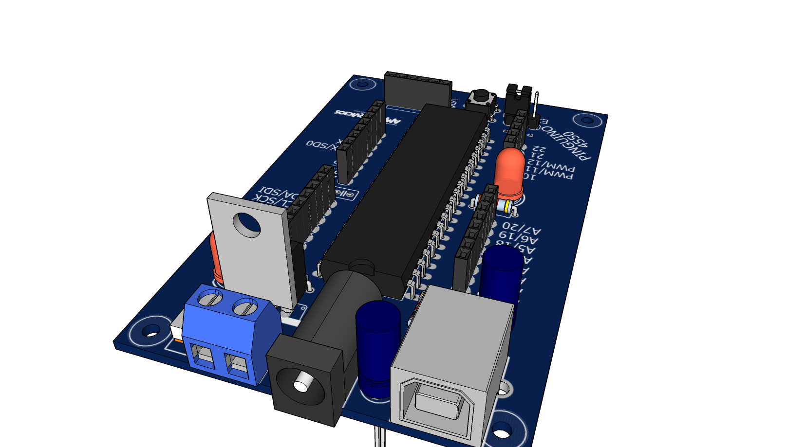

#Pingüino 4550

## Description

Board for a Pingüino with a PIC 18F4550.

##Features
- USB type B input.
- Jumper selector for power supply (USB or External).
	- External input provides a PowerJack or a Screw Terminal.
	- External input must be between 7V and 12V.
- ICSP input for programming directly to the PIC using a PICKit2 (useful for uploading the bootloader).
- Reset button.
- Power and User LEDs.
- Mounting holes.
- Small form factor, ~9cm x ~6cm

